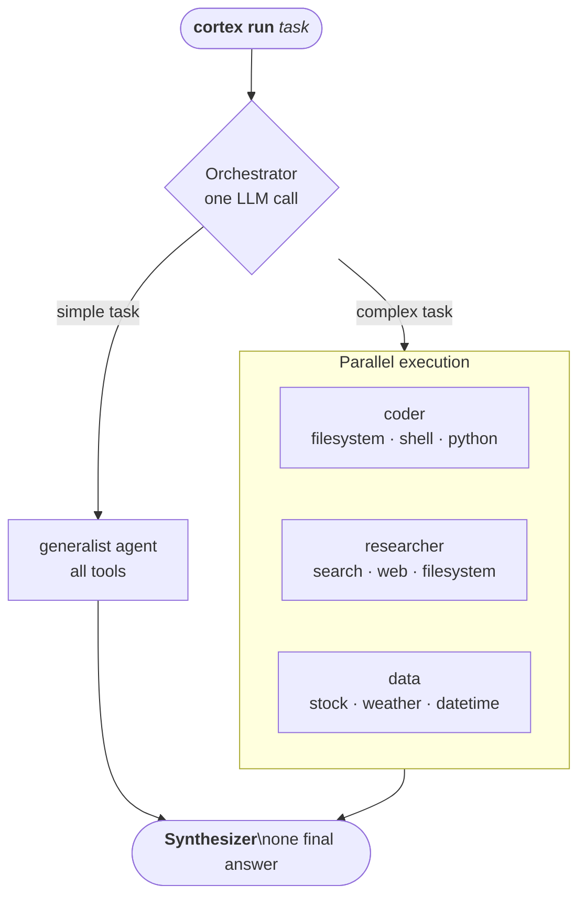

<div align="center">

<pre>
██████╗ ██████╗ ██████╗ ████████╗███████╗██╗  ██╗
██╔════╝██╔═══██╗██╔══██╗╚══██╔══╝██╔════╝╚██╗██╔╝
██║     ██║   ██║██████╔╝   ██║   █████╗   ╚███╔╝ 
██║     ██║   ██║██╔══██╗   ██║   ██╔══╝   ██╔██╗ 
╚██████╗╚██████╔╝██║  ██║   ██║   ███████╗██╔╝ ██╗
 ╚═════╝ ╚═════╝ ╚═╝  ╚═╝   ╚═╝   ╚══════╝╚═╝  ╚═╝
</pre>

**Local AI agents with tools, in your terminal — powered by Ollama.**

Zero API cost · Full control · Parallel orchestration · Streams every step live

[](https://python.org)
[](LICENSE)
[](https://ollama.com)
[](https://github.com/BerriAI/litellm)

</div>

---

## How it works



**Simple task** → one generalist agent handles it.  
**Complex task** → planner decomposes it into subtasks, assigns specialists, runs in parallel, merges results. Always falls back to single if planning fails.

---

## Requirements

- **Python 3.11+**
- **[Ollama](https://ollama.com)** installed and running

---

## Installation

```bash
git clone https://github.com/benjaghv/cortex
cd cortex
python -m venv .venv

# Windows
.venv\Scripts\activate
# macOS / Linux
source .venv/bin/activate

pip install -e ".[dev]"
```

---

## Setup

### 1. Start Ollama and pull a model

```bash
ollama serve                      # keep running in a separate terminal
ollama pull qwen2.5-coder:7b      # recommended default
ollama pull qwen2.5-coder:1.5b    # fast planner (optional but useful)
```

### 2. Initialize config

```bash
cortex config --init
```

Creates `~/.cortex/config.toml` with sensible defaults. Lives **outside the project** — may contain API keys, never committed to git.

### 3. Verify

```bash
cortex run "what time is it?"
```

You should see a task banner, a `datetime` tool call, and a response. Setup complete.

---

## Usage

### One-shot task

```bash
cortex run "what's the weather in Tokyo?"
cortex run "read my README.md and summarize it"
cortex run "get AAPL and NVDA stock prices"
cortex run "search the web for the latest Python release"
```

### Interactive chat session

```bash
cortex chat
```

| Command | Action |
|---|---|
| `/models` | list local and cloud models |
| `/model <name or #>` | switch model for this session |
| `/verbose` | toggle verbose mode |
| `/dry-run <task>` | plan without executing |
| `exit` | quit |

### Flags

```bash
cortex run --single "task"            # skip orchestration, use one agent
cortex run --dry-run "task"           # show planned tool calls, don't run
cortex run -v "task"                  # verbose: every step, args, errors
cortex run -m ollama/qwen3:8b "task"  # override model for this run
```

---

## Commands

```
cortex run "task"        Run a task (auto-orchestrates agents)
cortex chat              Interactive multi-task session
cortex agents            List all agent presets and their tools
cortex models            List local + cloud models
cortex history           Show recent run history
cortex stats             Show tokens used and estimated cloud savings
cortex memory            Show remembered past tasks
cortex memory --clear    Clear all memory
cortex config --init     Create default config file
cortex version           Show version
```

---

## Agent presets

| Agent | Tools | Best for |
|---|---|---|
| **generalist** | all tools | simple or ambiguous tasks — default fallback |
| **coder** | filesystem, shell, python_exec | files, scripts, code |
| **researcher** | search, web, filesystem | web search, URL fetching, docs |
| **data** | stock, weather, datetime, python_exec | live prices, weather, date math |

Each agent only sees its assigned tools — no accidental cross-contamination.

---

## Built-in tools

| Tool | What it does | API key? |
|---|---|---|
| `filesystem` | Read, write, list, search, create folders | No |
| `shell` | Run allowed shell commands | No |
| `web` | Fetch a URL and extract its text | No |
| `search` | DuckDuckGo web search | No |
| `stock` | Real-time stock and crypto quotes | No |
| `weather` | Current weather + forecast for any city | No |
| `datetime` | Current local date and time | No |
| `python_exec` | Run a Python snippet, capture output | No |

---

## Project structure

```
cortex/
  cli.py              → CLI commands
  agent.py            → Shim: delegates to orchestrate() or dry-run
  config.py           → Settings from ~/.cortex/config.toml
  display.py          → All terminal output (Rich)
  events.py           → Thread-safe EventBus
  stats.py            → Token counting + savings estimate
  memory.py           → Cross-session task memory

  agents/
    preset.py         → AgentPreset dataclass
    presets.py        → Built-in presets
    prompt_base.py    → Shared system-prompt scaffolding
    llm.py            → litellm wrappers + cloud routing
    runner.py         → One ReAct loop, emits Events
    orchestrator.py   → Heuristic → planner → single/parallel → synthesis

  tools/
    registry.py       → ToolRegistry: name → (schema, executor)
    filesystem.py     shell.py     web.py      search.py
    stock.py          weather.py   datetime_tool.py   python_exec.py
```

> `~/.cortex/` — config, stats, memory, run logs. Auto-created, never committed.

---

## Cloud providers (optional)

Works 100% locally out of the box. Add a key to `~/.cortex/config.toml` to unlock cloud models.

```bash
cortex models   # shows ● configured  ○ not configured
```

| Provider | Config key | Example model |
|---|---|---|
| [Ollama Cloud](https://ollama.com) | `ollama_cloud_api_key` | `ollama-cloud/gemma3:4b` |
| [Kimi / Moonshot](https://platform.moonshot.cn) | `kimi_api_key` | `moonshot-v1-128k` |
| [Qwen / Alibaba](https://dashscope.aliyuncs.com) | `qwen_api_key` | `qwen-plus` |
| [GLM / Zhipu](https://open.bigmodel.cn) | `glm_api_key` | `glm-4-plus` |

```bash
cortex run -m "ollama-cloud/gemma3:4b" "your task"
```

See `config.example.toml` for the full config reference.

---

## Memory & stats

Cortex remembers completed tasks across sessions. After each run, a summary is saved and injected into the next run's context automatically.

```bash
cortex memory          # view recent remembered tasks
cortex stats           # tokens used + estimated cloud savings
```

---

## Adding a new tool

1. Create `cortex/tools/mytool.py` — `SCHEMA` dict + `execute(**args) -> str`
2. Register in `cortex/tools/registry.py` → `_default_entries`
3. Add verb in `cortex/display.py` → `_VERBS`
4. Add to a preset's `tools` tuple in `cortex/agents/presets.py`

---

## Running tests

```bash
pytest -v
```

Tool logic only — no LLM calls or network required.

---

## License

MIT
