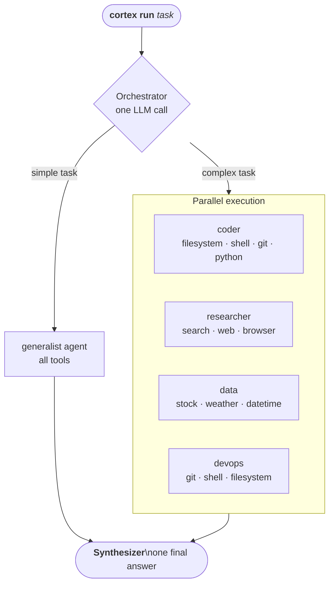

<div align="center">

<pre>
██████╗ ██████╗ ██████╗ ████████╗███████╗██╗  ██╗
██╔════╝██╔═══██╗██╔══██╗╚══██╔══╝██╔════╝╚██╗██╔╝
██║     ██║   ██║██████╔╝   ██║   █████╗   ╚███╔╝ 
██║     ██║   ██║██╔══██╗   ██║   ██╔══╝   ██╔██╗ 
╚██████╗╚██████╔╝██║  ██║   ██║   ███████╗██╔╝ ██╗
 ╚═════╝ ╚═════╝ ╚═╝  ╚═╝   ╚═╝   ╚══════╝╚═╝  ╚═╝
</pre>

**Local AI agents with tools, in your terminal — powered by Ollama.**

Zero API cost · Full control · Parallel orchestration · Streams every step live

[](https://python.org)
[](LICENSE)
[](https://ollama.com)
[](https://github.com/BerriAI/litellm)

</div>

---

## How it works



**Simple task** → one generalist agent handles it.  
**Complex task** → planner decomposes it into subtasks, assigns specialists, runs in parallel, merges results. Always falls back to single if planning fails.

---

## Requirements

- **Python 3.11+**
- **[Ollama](https://ollama.com)** installed and running

---

## Installation

```bash
git clone https://github.com/benjaghv/cortex
cd cortex
python -m venv .venv

# Windows
.venv\Scripts\activate
# macOS / Linux
source .venv/bin/activate

pip install -e ".[dev]"
```

That single install makes **every tool work out of the box** — Word/`.docx`, PowerPoint/`.pptx`,
Gmail, and voice transcription are all included. The only two extras that need a system-level piece
pip can't provide are the **microphone** (PortAudio) and the **headless browser** (Chromium download).
Prepare any device for those with one command:

```bash
cortex setup            # check which tool deps are present on this device
cortex setup --install  # install the missing ones (mic + browser)
```

> On Mac/Linux the microphone needs PortAudio first: `brew install portaudio` (Mac) or
> `sudo apt install portaudio19-dev` (Linux). `cortex setup` tells you if it's missing.

---

## Local models

Pick one based on your hardware. All free, no API key needed.

| Model | Size | RAM | Best for |
|---|---|---|---|
| `qwen2.5-coder:1.5b` | 1 GB | 4 GB+ | Low-end hardware, fast responses |
| `qwen2.5-coder:7b` ⭐ | 5 GB | 8 GB+ | Coding tasks — recommended default |
| `qwen2.5-coder:14b` | 9 GB | 16 GB+ | Higher quality coding |
| `qwen3:8b` | 5 GB | 8 GB+ | General tasks, good reasoning |
| `deepseek-r1:8b` | 5 GB | 8 GB+ | Research, analysis, chain-of-thought |
| `deepseek-r1:14b` | 9 GB | 16 GB+ | Strong reasoning |
| `llama3.2:3b` | 2 GB | 6 GB+ | Light, fast, general use |
| `phi4:14b` | 9 GB | 16 GB+ | Efficient, strong quality |
| `gemma3:4b` | 3 GB | 6 GB+ | Google model, multilingual |

> **Not sure?** Start with `qwen2.5-coder:1.5b` (low RAM) or `qwen2.5-coder:7b` (8GB+ RAM).  
> More models at [ollama.com/search](https://ollama.com/search).

---

## Setup

### 1. Start Ollama and pull a model

```bash
ollama serve                      # keep running in a separate terminal
ollama pull qwen2.5-coder:7b      # recommended default (5 GB, 8 GB+ RAM)
ollama pull qwen2.5-coder:1.5b    # lightweight planner / low-end hardware
```

### 2. Initialize config

```bash
cortex config --init
```

Creates `~/.cortex/config.toml` with sensible defaults. Lives **outside the project** — may contain API keys, never committed to git.

### 3. Verify

```bash
cortex run "what time is it?"
```

You should see a task banner, a `datetime` tool call, and a response. Setup complete.

---

## Usage

### One-shot task

```bash
cortex run "what's the weather in Tokyo?"
cortex run "read my README.md and summarize it"
cortex run "get AAPL and NVDA stock prices"
cortex run "search the web for the latest Python release"
cortex run "show git log for the last 5 commits"
cortex run "find software engineer jobs in Santiago on LinkedIn"
```

### Git workflow

```bash
cortex chat
/repo C:\Projects\my-app     # set active repo (any path on your PC)
dame el status del repo       # git status
hace commit de todo con mensaje 'fix login bug'
haz push
```

### Interactive chat session

```bash
cortex chat
```

| Command | Action |
|---|---|
| `/models` | list local and cloud models |
| `/model <name or #>` | switch local model by name or number |
| `/model <letter>` | switch cloud model by letter (a, b, c…) |
| `/repo <path>` | set active git repo for this session |
| `/repo` | show current active repo path |
| `/verbose` | toggle verbose mode |
| `/voice` | dictate your next prompt by speaking |
| `/account [email]` | show or switch the active Google account |
| `/dry-run <task>` | plan without executing |
| `exit` | quit |

### Voice (dictation)

Talk to cortex instead of typing. Transcription ships with the base install; microphone capture
needs PortAudio — run `cortex setup --install` (and `brew install portaudio` first on Mac).

```bash
cortex voice                  # speak one task, cortex transcribes and runs it
cortex voice --lang en-US     # set speech language (default es-ES)
```

Inside a chat session, type `/voice`, speak when you see **🎤 Escuchando…**, and your
words become the next prompt. Transcription uses the Google Web Speech API (no key, needs internet).

### Flags

```bash
cortex run --single "task"            # skip orchestration, use one agent
cortex run --dry-run "task"           # show planned tool calls, don't run
cortex run -v "task"                  # verbose: every step, args, errors
cortex run -m ollama/qwen3:8b "task"  # override model for this run
```

---

## Commands

```
cortex run "task"        Run a task (auto-orchestrates agents)
cortex chat              Interactive multi-task session
cortex voice             Speak a task instead of typing it (dictation)
cortex connect gmail     Connect a Gmail account (OAuth, persistent)
cortex accounts          List connected accounts · --use <email> to switch
cortex disconnect gmail  Remove a connected account
cortex setup             Check tool deps · --install to add missing ones
cortex agents            List all agent presets and their tools
cortex models            List local + cloud models
cortex history           Show recent run history
cortex stats             Show tokens used and estimated cloud savings
cortex memory            Show remembered past tasks
cortex memory --clear    Clear all memory
cortex config --init     Create default config file
cortex version           Show version
```

---

## Agent presets

| Agent | Tools | Best for |
|---|---|---|
| **generalist** | all tools | simple or ambiguous tasks — default fallback |
| **coder** | filesystem, shell, git, python_exec, document, pptx | files, scripts, code, git ops, Word docs, slides |
| **devops** | git, shell, filesystem, python_exec | repo management, commits, diffs |
| **researcher** | search, web, browser, filesystem | web search, URL fetching, JS-heavy sites, job boards |
| **data** | stock, weather, datetime, python_exec | live prices, weather, date math |
| **comms** | gmail, search, web | reading + summarizing email, lookups |

Each agent only sees its assigned tools — no accidental cross-contamination.

---

## Built-in tools

| Tool | What it does | API key? |
|---|---|---|
| `filesystem` | Read, write, list, search, create folders | No |
| `shell` | Run allowed shell commands | No |
| `git` | status, diff, log, branch, add, commit, push, pull, stash… | No |
| `web` | Fetch a URL, strip HTML, return plain text | No |
| `browser` | Real headless browser (Playwright) — JS sites, job boards, SPAs | No* |
| `search` | DuckDuckGo web search | No |
| `stock` | Real-time stock and crypto quotes | No |
| `weather` | Current weather + forecast for any city | No |
| `datetime` | Current local date and time | No |
| `python_exec` | Run a Python snippet, capture output | No |
| `document` | Create formatted Word (.docx) or plain text files with headings, bullets, bold | No* |
| `pptx` | Create PowerPoint (.pptx) presentations — 4 themes, layouts, speaker notes | No* |
| `gmail` | Read your Gmail (read-only) — search, list, read, summarize email | OAuth* |

> \* `document` (.docx), `pptx` (.pptx) and `gmail` deps ship with the base install — nothing extra.
> `browser` needs Chromium: run `cortex setup --install`.
> `gmail` also needs a one-time `cortex connect gmail` (see [Connect external services](#connect-external-services-gmail)).

---

## Project structure

```
cortex/
  cli.py              → CLI commands
  agent.py            → Shim: delegates to orchestrate() or dry-run
  config.py           → Settings from ~/.cortex/config.toml
  display.py          → All terminal output (Rich)
  events.py           → Thread-safe EventBus
  stats.py            → Token counting + savings estimate
  memory.py           → Cross-session task memory
  voice.py            → Speech-to-text dictation (cortex voice + /voice)

  integrations/
    google_auth.py    → Google OAuth: connect, persistent tokens, account switching

  agents/
    preset.py         → AgentPreset dataclass
    presets.py        → Built-in presets
    prompt_base.py    → Shared system-prompt scaffolding
    llm.py            → litellm wrappers + cloud routing
    runner.py         → One ReAct loop, emits Events
    orchestrator.py   → Heuristic → planner → single/parallel → synthesis

  tools/
    registry.py       → ToolRegistry: name → (schema, executor)
    filesystem.py     shell.py      git_tool.py   web.py
    browser.py        search.py     stock.py      weather.py
    datetime_tool.py  python_exec.py  document.py  pptx.py  gmail.py
```

> `~/.cortex/` — config, stats, memory, run logs. Auto-created, never committed.

---

## Cloud providers (optional)

Works 100% locally out of the box. Add a key to `~/.cortex/config.toml` to unlock cloud models — no local GPU needed.

```bash
cortex models   # shows ● configured  ○ not configured
```

### Ollama Cloud (recommended — same API key, many models)

**1. Get your API key**

Go to **[ollama.com](https://ollama.com)** → sign in → **Settings → API Keys** → create a key.  
Looks like: `93fb7deb...njdgOCDY_kbMXRqeOw4XEA3T`

**2. Add it to your config**

```bash
cortex config --init   # creates ~/.cortex/config.toml if it doesn't exist
```

Open `~/.cortex/config.toml` and add:

```toml
ollama_cloud_api_key = "your-key-here"
```

**3. Use a cloud model**

```bash
cortex chat
/model a        # switch to first cloud model (kimi-k2.6:cloud)
/models         # see all available cloud models with letters a, b, c…
```

Or directly:

```bash
cortex run -m "ollama-cloud/kimi-k2.6:cloud" "your task"
```

**Available Ollama Cloud models** (free unless noted):

| Letter | Model | Notes |
|---|---|---|
| a | `kimi-k2.6:cloud` | 595B · Kimi |
| b | `qwen3.5:cloud` | Qwen 3.5 |
| c | `glm-5.1:cloud` | GLM 5.1 |
| d | `minimax-m3:cloud` | MiniMax M3 |
| e | `nemotron-3-super:cloud` | NVIDIA Nemotron |
| f | `gemma4:31b-cloud` | Google Gemma 4 · 31B |
| g | `gemma3:4b` | fast |
| h | `gemma3:27b` | better |
| i | `qwen3-coder-next` | coding |

> **Tip:** if Ollama is not installed or not running, cortex detects it at startup and suggests switching to a cloud model automatically.

---

### Other providers (optional)

| Provider | Config key | Example model |
|---|---|---|
| [Kimi / Moonshot](https://platform.moonshot.cn) | `kimi_api_key` | `moonshot-v1-128k` |
| [Qwen / Alibaba](https://dashscope.aliyuncs.com) | `qwen_api_key` | `qwen-plus` |
| [GLM / Zhipu](https://open.bigmodel.cn) | `glm_api_key` | `glm-4-plus` |

See `config.example.toml` for the full config reference.

---

## Connect external services (Gmail)

Let agents read your email. **Read-only** — cortex can search, read and summarize, but never send.
Auth uses your own Google Cloud project (full control, no third-party server sees your data) and is
**persistent** (stays logged in) and **switchable** (multiple accounts). The Google libraries ship
with the base install — you only need the one-time setup below.

### Guided setup — just run it

```bash
cortex connect gmail
```

The first time, cortex prints a guide, **opens the right Google Cloud pages for you**, and **watches your
folder** — the moment the downloaded `client_secret.json` lands (in `~/.cortex/credentials/` or
Downloads) it detects it. Crucially, it then reads the **project id from that file** and opens the exact
pages for *that* project, so you never get lost across projects. You only do the clicks Google requires:

> ⚠️ **Do everything in the SAME Google Cloud project.** Watch the project picker (top-left) — mixing
> projects (client in one, test user in another) is the #1 cause of `403 access_denied`.

1. Create or pick **one project**
2. **Clients** → *Create OAuth client* → type **Desktop app** → **Download JSON**
   (if asked, set up the consent screen first: Branding → app name + your email)
3. Save the JSON to `~/.cortex/credentials/` (or Downloads) — cortex detects it and, for **that project**, opens:
   - **Enable the Gmail API** → click *Enable*
   - **Audience → Test users** → add your Gmail address
4. Press Enter — cortex connects. Stays in *Testing* mode (access renews every ~7 days via `cortex connect gmail`).

If the Gmail API isn't enabled yet, cortex catches it and prints the exact enable link for your project.

Then just use it:

```bash
cortex run "summarize my unread emails from this week"
cortex run "any email from my bank? show the latest one"
```

> Prefer to do it by hand? `cortex connect gmail --client-secret <path>` skips the assistant.

### Manage accounts

```bash
cortex accounts                       # list connected accounts (★ = active)
cortex accounts --use you@gmail.com   # switch the active account
cortex disconnect gmail you@gmail.com # remove an account
```

Inside `cortex chat`, use `/account` to view or switch accounts on the fly. Tokens live in
`~/.cortex/credentials/` (never committed).

---

## Memory & stats

Cortex remembers completed tasks across sessions. After each run, a summary is saved and injected into the next run's context automatically.

```bash
cortex memory          # view recent remembered tasks
cortex stats           # tokens used + estimated cloud savings
```

---

## Adding a new tool

1. Create `cortex/tools/mytool.py` — `SCHEMA` dict + `execute(**args) -> str`
2. Register in `cortex/tools/registry.py` → `_default_entries`
3. Add verb in `cortex/display.py` → `_VERBS`
4. Add to a preset's `tools` tuple in `cortex/agents/presets.py`

---

## Running tests

```bash
pytest -v
```

Tool logic only — no LLM calls or network required.

---

## License

MIT
